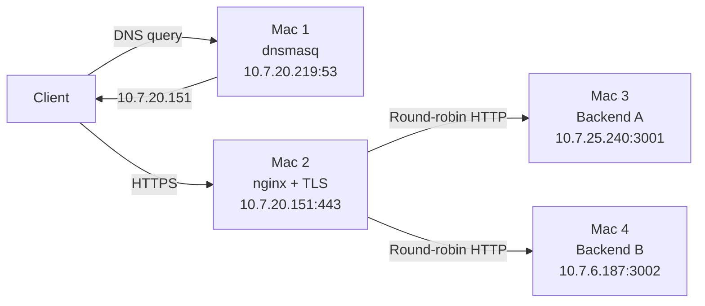
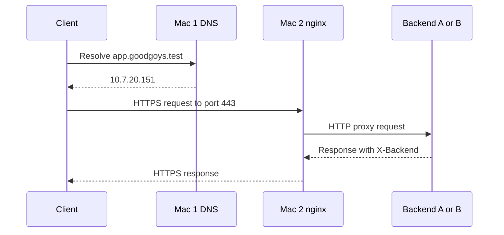
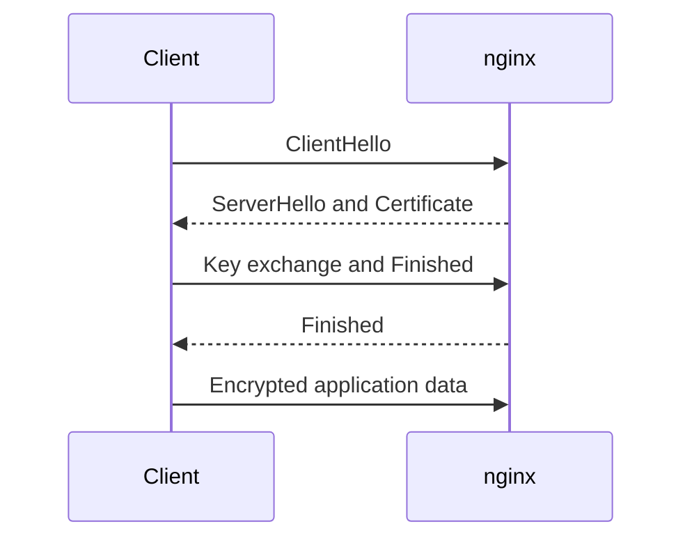
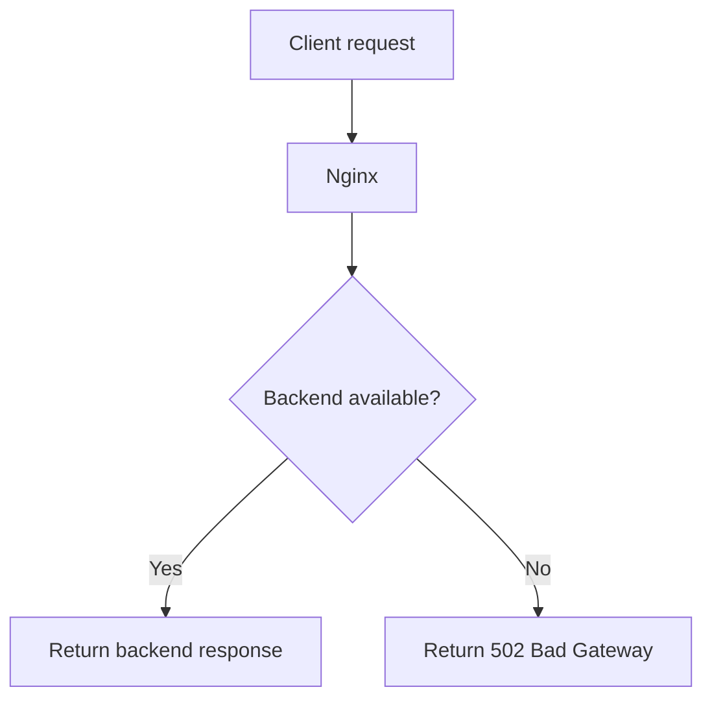

# Private Network Service Platform

   

## Overview

This project demonstrates a private DNS service, an HTTPS reverse proxy, and two LAN-accessible Node.js backends.

- **Mac 1:** private DNS with `dnsmasq`
- **Mac 2:** nginx TLS termination and load balancing
- **Mac 3:** Backend A on port `3001`
- **Mac 4:** Backend B on port `3002`

Clients use `app.goodgoys.test` and connect only to Mac 2. Nginx hides the backend addresses from clients.

## Topology



| Node | Role | Address | Port |
|---|---|---|---|
| Mac 1 | DNS | `10.7.20.219` | UDP/TCP `53` |
| Mac 2 | Edge and load balancer | `10.7.20.151` | HTTPS `443` |
| Mac 3 | Backend A | `10.7.25.240` | HTTP `3001` |
| Mac 4 | Backend B | `10.7.6.187` | HTTP `3002` |

## Request Flow



| Layer | Source | Destination |
|---|---|---|
| DNS | Client ephemeral UDP port | Mac 1 UDP `53` |
| TCP/TLS/HTTPS | Client ephemeral TCP port | Mac 2 TCP `443` |
| Backend proxy | Mac 2 ephemeral TCP port | Mac 3 `3001` or Mac 4 `3002` |

## DNS

Mac 1 maps both application names to the edge IP:

```text
app.goodgoys.test -> 10.7.20.151
api.goodgoys.test -> 10.7.20.151
```

Test from Mac 1:

```sh
dig @127.0.0.1 app.goodgoys.test
```

Test from another client configured to use Mac 1:

```sh
dig @10.7.20.219 app.goodgoys.test
```

A public resolver such as `1.1.1.1` does not contain this private `.test` record and returns `NXDOMAIN`.

## Backends

Both Node.js services bind to `0.0.0.0`, so they are reachable from the LAN.

| Endpoint | Required behavior |
|---|---|
| `GET /` | Confirms that the backend is running and returns cache headers |
| `GET /api/status` | Returns JSON with backend identity and `status: ok` |
| Response header | `X-Backend: A` or `X-Backend: B` |

Example response:

```json
{"backend":"A","status":"ok"}
```

The `/` endpoint also demonstrates HTTP caching with `Cache-Control: public, max-age=60` and an `ETag`. Verify it with:

```sh
curl -I https://app.goodgoys.test/
```

## Nginx and TLS

Nginx is the only client-facing service. It terminates TLS on port `443`, then proxies requests to the backend pool. Equal upstream weights provide round-robin balancing.

The TLS sequence is:



The client trusts the local CA that issued the certificate for `app.goodgoys.test`. Test without bypassing certificate validation:

```sh
curl -v https://app.goodgoys.test/api/status
```

The Wireshark capture should show the TLS handshake and encrypted application data, but not the HTTP path or body.

## Load-Balancing Test

Run repeated requests through nginx:

```sh
for i in {1..10}; do
  curl -sS -D - -o /dev/null https://app.goodgoys.test/api/status \
    | grep -i '^X-Backend:'
done
```

Both `X-Backend: A` and `X-Backend: B` must appear. The order may vary.

## Failure Tests

| Test | Expected result | Meaning |
|---|---|---|
| Wrong DNS server | Name lookup fails, but direct IP access may work | DNS and IP connectivity are separate |
| Wrong DNS address | Lookup succeeds, but traffic reaches the wrong host | DNS maps names; it does not validate applications |
| Stop one backend | Nginx uses the remaining healthy backend after a failed upstream request | The edge can isolate an unavailable backend |
| Stop both backends | DNS and TLS still work; nginx returns `502 Bad Gateway` | The failure is between the edge and backends |
| Wrong destination port | Host may be reachable, but the service connection fails | IP and port identify different things |



## Evidence Checklist

Capture one request with Wireshark or `tcpdump` and show:

- DNS query and response: `app.goodgoys.test` resolves to `10.7.20.151`.
- TCP `SYN`, `SYN-ACK`, and `ACK` before application data.
- TLS `ClientHello`, `ServerHello`, `Certificate`, and encrypted data.
- HTTP headers from `curl -v`, including `X-Backend`.
- Repeated requests reaching both backends.
- Client ephemeral ports and destination ports `53` and `443`.

Useful commands:

```sh
dig app.goodgoys.test
curl -v https://app.goodgoys.test/api/status
curl -I https://app.goodgoys.test/
```

## Validation

```sh
make dnsmasq-config
dnsmasq --test -C config/dnsmasq.conf
sudo nginx -t -c "$PWD/config/nginx.conf"
curl -sS https://app.goodgoys.test/api/status
```

Do not commit private keys or the CA private key. Certificate files are excluded by `.gitignore`.

## Configuration Note

The active nginx configuration and `infra/env.sh` use `10.7.25.240` for Mac 3. The older network inventory lists `10.7.20.220`. Reconcile this address before the final demonstration; this report follows the active nginx configuration.
